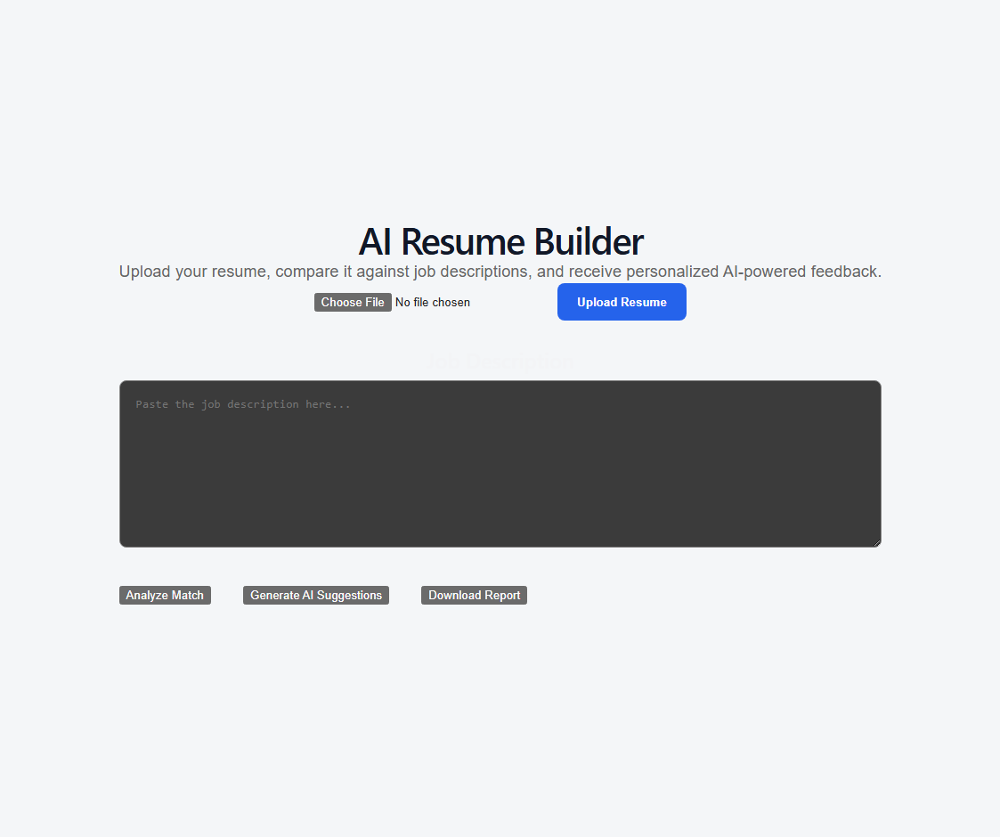
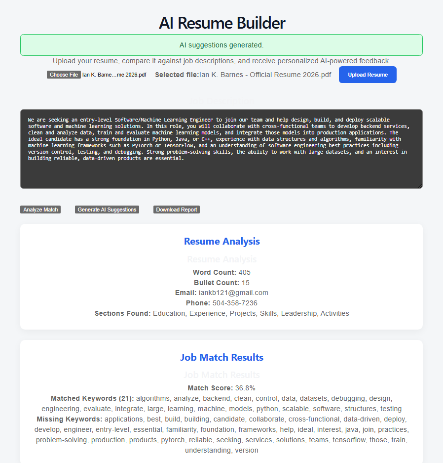
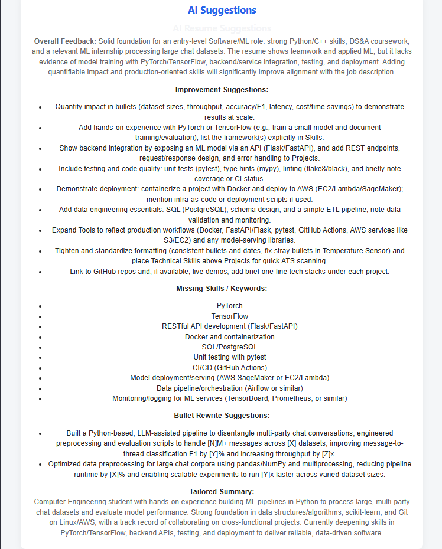
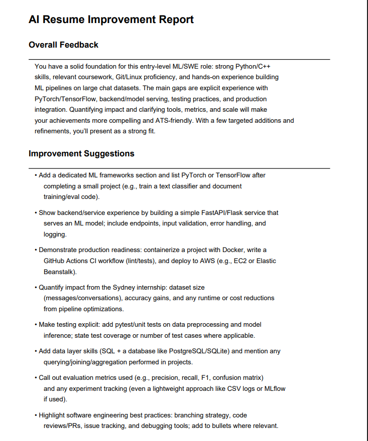
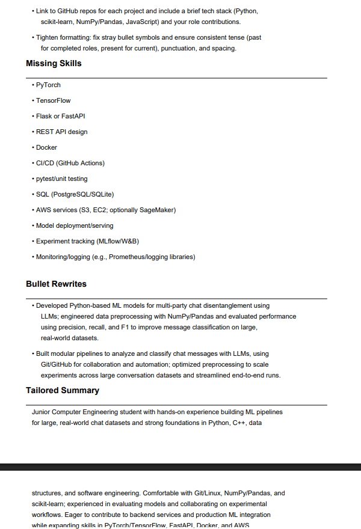

# AI Resume Builder

An AI-powered resume builder and job-tailoring web application that helps users upload resumes, analyze their content, match them to job descriptions, and improve resume bullet points with AI assistance.

---

## Live Demo

**Frontend:** https://ai-resume-builder-1te8a3ktl-ian-barnes.vercel.app

**Backend API:** https://ai-resume-builder-pogp.onrender.com

---

## Screenshots

### Home Page



### Resume Analysis



### AI Suggestions



### Generated PDF




---

## Project Overview

This project is a full-stack application built with a React frontend and a FastAPI backend. The goal is to allow users to upload a resume PDF, extract and analyze its contents, compare it against a job description, generate AI-powered suggestions to improve the resume and download a professional PDF improvement report exported by the application.

---

## Features

- Resume PDF Upload
- Resume Analysis
- Job Description Matching
- AI-powered resume feedback
- PDF report generation
- Responsive React UI
- FastAPI backend

---

## Tech Stack

### Frontend
- React
- TypeScript
- Vite
- Axios
- CSS Modules

### Backend
- Python
- FastAPI
- Uvicorn

### AI 
- OpenAI API

### Libraries
- PyMuPDF
- ReportLab

---

## Folder Structure

```bash
AI-Resume-Builder/
│
├── frontend/          # React + TypeScript frontend
├── backend/           # FastAPI backend
├── docs/              # Project planning and roadmap
├── sample_resumes/    # Test resumes for development
├── screenshots/       # Images for README/demo
├── README.md
├── .gitignore
└── LICENSE

---
